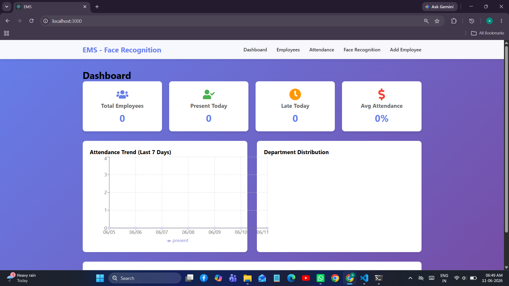

# Employee Management System with Face Recognition

A comprehensive MERN (MongoDB, Express.js, React, Node.js) stack application for managing employees and attendance with integrated face recognition technology.


### Dashboard Overview

*Main dashboard showing attendance analytics and statistics*

## 🚀 Features

### Employee Management
- ✅ Add, edit, and delete employee records
- ✅ Upload employee photos
- ✅ Search and filter employees
- ✅ View employee details and history

### Attendance Tracking
- ✅ Mark attendance manually
- ✅ View attendance reports
- ✅ Filter by date range
- ✅ Export attendance data
- ✅ Dashboard with attendance analytics

### Face Recognition
- ✅ Real-time face detection using webcam
- ✅ Register employee faces
- ✅ Mark attendance via face recognition
- ✅ Prevent duplicate attendance
- ✅ Face descriptor storage for recognition

### Security
- ✅ JWT authentication
- ✅ Password encryption (bcrypt)
- ✅ Role-based access control
- ✅ Secure API endpoints

## 📋 Prerequisites

Before you begin, ensure you have the following installed:

- **Node.js** (v14 or higher) - [Download](https://nodejs.org/)
- **MongoDB** (v4.4 or higher) - [Download](https://www.mongodb.com/try/download/community)
- **npm** or **yarn** (comes with Node.js)
- **Git** (optional) - [Download](https://git-scm.com/)

## 🛠️ Tech Stack

**Backend:**
- Express.js - Web framework
- MongoDB with Mongoose - Database
- JWT - Authentication
- Multer - File upload
- bcryptjs - Password hashing
- face-api.js - Face recognition

**Frontend:**
- React.js - UI library
- Axios - HTTP client
- React Router - Navigation
- React Webcam - Camera integration
- React Toastify - Notifications
- Chart.js - Analytics charts

## 📦 Installation

### 1. Clone the Repository

```bash
git clone https://github.com/yourusername/employee-management-system.git
cd employee-management-system
